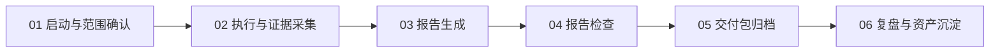

# Product Testing Skill 总览

## IA Thesis

本仓库按正式测试交付生命周期组织：先确认测试任务，再执行和采集证据，然后生成报告，最后检查并归档交付包。复杂工具、Skill 和脚本都放到对应阶段下，不再堆在一个大工作流里。

## 生命周期

## 核心产物

| 产物 | 文件 | 读者 | 关键检查 |
|---|---|---|---|
| 运行过程证据报告 | `01_运行过程证据报告.md/html/pdf` | 内部复核、审计 | 证据可反查、失败样本齐全 |
| 实际交付报告 | `02_实际交付报告.md/html/pdf` | 客户、业务负责人 | 标题为“测试报告”、客户可读、无本机路径 |
| 五轮业务论证与结果 | `03_五轮业务论证与结果.md/html/pdf` | 产品、交付、管理层 | 论证、用例、统计一致 |
| 交付 zip | `04_交付报告_*.zip` | 交付存档 | 只含最终产物和必要证据 |

## 目录地图

| 目录 | 职责 |
|---|---|
| `references/workflows/` | 阶段流程和执行顺序 |
| `references/checklists/` | 报告、PDF、交付包检查门禁 |
| `references/matrices/` | Skill / 工具职责、报告输出映射 |
| `references/templates/` | 测试报告、缺陷记录等模板 |
| `scripts/` | 该 Skill 专用自动化脚本和报告生成器 |
| `SKILL.md` | Agent 可调用的技能说明 |
| `../../..` | GitHub 仓库根目录，也是 Obsidian 直接阅读入口 |

## 维护规则

- 新流程先进入 `references/workflows/`，不要塞回总览。
- 新检查项先进入 `references/checklists/`，再由总览链接。
- 新工具先登记到 [Skill / 工具职责矩阵](matrices/skill-tool-responsibility-matrix.md)。
- Obsidian 使用方式先登记到仓库级 [Obsidian 直接使用说明](../../../docs/obsidian-usage.md)。
- 面向客户的正式报告不得出现 `file://`、`C:\`、`C:/`、用户目录、临时目录或浏览器默认页眉页脚。
- 提交 GitHub 前必须通过仓库级 [GitHub 提交安全门禁](../../../docs/github-submit-safety-gate.md)。
- Obsidian 直接读取本仓库 Markdown，不再维护第二份目录。
